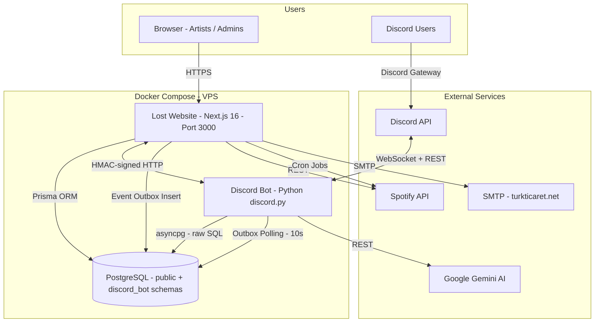
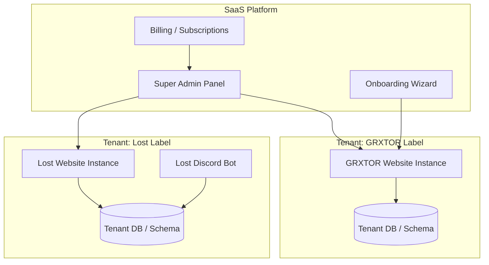

# Lost Website — Phase Plan & Roadmap

> **Last updated:** 2026-03-02  
> **Project:** Lost Label Management Platform + Discord Bot  
> **Stack:** Next.js 16 · Prisma 6 · Tailwind 4 · Python discord.py · PostgreSQL · Docker

---

## Table of Contents

1. [Architecture Overview](#architecture-overview)
2. [Phase 1 — Foundation (COMPLETED)](#phase-1--foundation-completed)
3. [Phase 2 — Discord Integration (MOSTLY COMPLETED)](#phase-2--discord-integration-mostly-completed)
4. [Phase 3 — Enhanced Notifications (IN PROGRESS)](#phase-3--enhanced-notifications-in-progress)
5. [Phase 4 — SaaS Transformation (PLANNED)](#phase-4--saas-transformation-planned)
6. [Phase 5 — Advanced Features (FUTURE)](#phase-5--advanced-features-future)
7. [Known Issues & Technical Debt](#known-issues--technical-debt)
8. [Environment & Deployment](#environment--deployment)

---

## Architecture Overview



### Communication Patterns

| Pattern | Direction | Mechanism |
|---------|-----------|-----------|
| Internal API calls | Website → Bot | HMAC-signed HTTP via `LOST_SITE_INTERNAL_BASE_URL` |
| Event outbox | Website → Bot | Website inserts into `discord_bot.event_outbox`, bot polls every 10s |
| Role sync | Website → Bot | Dedicated `role_sync_queue` table, bot polls every 10s |
| Direct DB reads | Bot → Website data | Bot reads `public` schema tables via asyncpg |
| Discord OAuth | Website ↔ Discord API | OAuth2 flow with state token stored in DB |

### Database Architecture

- **`public` schema** — Managed by Prisma; contains all website models: `User`, `Artist`, `Release`, `Contract`, `Earning`, `Payment`, `Demo`, `DemoFile`, `ChangeRequest`, `SiteContent`, `SystemSettings`, `Webhook`, etc.
- **`discord_bot` schema** — Managed by raw SQL in the bot; contains: `guilds`, `users`, `ai_channels`, `event_outbox`, `role_sync_queue`, `guild_policies`, `guild_features`, `discord_links`, `audit_log`, `events`, etc.

---

## Phase 1 — Foundation (COMPLETED)

The core website platform for managing a music label.

### Deliverables

| Feature | Status | Key Files |
|---------|--------|-----------|
| Next.js 16 app with SSR/RSC | ✅ Done | `app/layout.js`, `next.config.mjs` |
| Authentication (email/password + NextAuth) | ✅ Done | `app/api/auth/`, `lib/auth.js` |
| Email verification & password reset | ✅ Done | `app/api/auth/verify-email/`, `app/api/auth/forgot-password/` |
| Artist portal — releases, stats, earnings | ✅ Done | `app/api/artist/`, `app/artist/` |
| Artist withdrawal requests | ✅ Done | `app/api/artist/withdraw/` |
| Admin panel — user management | ✅ Done | `app/api/admin/users/` |
| Admin panel — content management | ✅ Done | `app/api/admin/content/` |
| Admin panel — system settings | ✅ Done | `app/api/admin/settings/` |
| Contract management (upload, sign, PDF generation) | ✅ Done | `app/api/contracts/`, `app/api/files/contract/` |
| Demo submission system | ✅ Done | `app/api/demo/` |
| Spotify integration — sync artists | ✅ Done | `app/api/cron/sync-artists/` |
| Spotify integration — sync listeners | ✅ Done | `app/api/cron/sync-listeners/` |
| Spotify integration — sync playlists | ✅ Done | `app/api/cron/sync-playlist/` |
| Email notifications (SMTP) | ✅ Done | `app/api/admin/communications/mail/` |
| Health check endpoint | ✅ Done | `app/api/health/` |
| Docker deployment (Dokploy/Docker Swarm) | ✅ Done | `Dockerfile`, `docker-compose.yml` |
| Recharts-based analytics | ✅ Done | Uses `recharts` in dashboard pages |
| PDF contract generation (pdf-lib + Playwright) | ✅ Done | `app/api/files/contract/[contractId]/` |

### Data Models (Prisma)

All models defined in `prisma/schema.prisma`:

- `User` — Artists and admins with notification preferences
- `Artist` — Spotify-synced artist profiles linked to users
- `ArtistStatsHistory` — Historical monthly listener/follower data
- `Release` — Albums, singles, EPs with Spotify metadata
- `Contract` — Label contracts with royalty splits and PDF URLs
- `RoyaltySplit` — Per-contract revenue distribution
- `Earning` — Period-based earnings per contract
- `Payment` — Withdrawal/payment records
- `Demo` / `DemoFile` — Demo submissions with file attachments
- `ChangeRequest` / `ChangeRequestComment` — Artist change requests with admin workflow
- `SiteContent` — CMS-style editable content blocks
- `SystemSettings` — Global configuration (JSON blob)
- `Webhook` — Configurable webhook endpoints

---

## Phase 2 — Discord Integration (MOSTLY COMPLETED)

AI-powered Discord bot integrated with the website via shared database and HMAC-signed HTTP.

### Deliverables

| Feature | Status | Key Files |
|---------|--------|-----------|
| Discord bot with slash commands | ✅ Done | `Discord Bot/bot.py` |
| AI chat powered by Gemini (gemini-3-flash-preview) | ✅ Done | `Discord Bot/src/services/ai_service.py` |
| AI personality system (per-user instructions) | ✅ Done | `Discord Bot/src/ui/views.py` — `AISetupView` |
| AI vision (image analysis) | ✅ Done | Feature flag `vision_ai` per guild |
| AI anti-repetition improvements | ✅ Done | Temperature tuning, context signals |
| Smart Helper (auto-assist in channels) | ✅ Done | Configurable mode: `questions_only`, `keyword_only`, `all_messages` |
| Server management with audit trail | ✅ Done | `Discord Bot/src/services/manage_service.py` |
| Raid guard / autopilot system | ✅ Done | `Discord Bot/src/services/raid_guard_service.py` |
| Memory service (user preferences) | ✅ Done | `Discord Bot/src/services/memory_service.py` |
| Audio analysis command | ✅ Done | `Discord Bot/src/services/audio_service.py` |
| Website ↔ Bot HMAC-signed HTTP | ✅ Done | `Discord Bot/src/services/site_integration_service.py` |
| Event outbox system | ✅ Done | `app/api/internal/discord/events/` |
| Discord OAuth account linking | ✅ Done | `app/api/discord/oauth/`, `app/api/profile/discord-link/` |
| Discord OAuth bug fix (missing `req` param) | ✅ Done | `app/api/profile/discord-link/route.js` — `POST(req)` |
| Demo submission from Discord | ✅ Done | `app/api/internal/discord/demo-submit/` |
| Demo status check from Discord | ✅ Done | `app/api/internal/discord/demo-status/` |
| Role sync (website → Discord) | ✅ Done | `app/api/internal/discord/role-sync/` |
| Bridge configuration via admin panel | ✅ Done | `app/api/admin/discord-bridge/` |
| Interactive server settings panel | ✅ Done | `Discord Bot/src/ui/views.py` — `ServerSettingsView` |
| Runtime config endpoint | ✅ Done | `app/api/internal/discord/runtime-config/` |
| Support ticket opening from Discord | ✅ Done | `app/api/internal/discord/support-open/` |
| Contract lookup from Discord | ✅ Done | `app/api/internal/discord/contracts/` |
| Earnings lookup from Discord | ✅ Done | `app/api/internal/discord/earnings/` |
| Link URL generation for Discord | ✅ Done | `app/api/internal/discord/link-url/` |
| Guild sync on bot startup | ✅ Done | `bot.py` — `on_ready()` |
| Per-guild feature flags | ✅ Done | `guild_features` table in `discord_bot` schema |
| Per-guild policy engine | ✅ Done | `guild_policies` table + `PolicyService` |
| Daily AI usage limits (free: 20, premium: 100) | ✅ Done | `bot.py` — `on_message()` |

### Remaining Items in Phase 2

| Item | Priority | Details |
|------|----------|---------|
| Bridge `enabled` flag | 🔴 High | The `discord_bridge` config in `SystemSettings` has an `enabled` flag that needs to be set to `true` in the database for the bridge to be active |
| `DISCORD_GUILD_ID` env var | 🔴 High | Currently empty — must be set to the target Discord server ID for role sync and guild-specific features |
| Discord OAuth redirect URI | 🟡 Medium | `DISCORD_REDIRECT_URI` currently points to a traefik.me domain — needs updating to the production domain |
| Stub API route cleanup | 🟡 Medium | Underscore-variant routes exist as re-exports: `demo_status/`, `demo_submit/`, `link_url/`, `support_open/`, `role_sync/ack/`, `role_sync/pull/` — these should be removed once the bot is confirmed to use kebab-case endpoints exclusively |
| Views.py Turkish labels | 🟡 Medium | `ServerSettingsView` sub-views (`AISettingsView`, `SecuritySettingsView`, `ChannelSettingsView`, `AutoDJSettingsView`) contain Turkish UI strings that need English translation. Examples: "Yetkisiz", "Ayar Güncellendi", "Otopilot Aç/Kapa", "Burst Eşiği", "Kullanıcı Eşiği", "AI Kanalı Ekle", "Hoş Geldin Mesajı", "Otomatik Rol Ekle", "Çalma Listesi Bağla", "Geri", "Sunucu Ayarları", etc. |

---

## Phase 3 — Enhanced Notifications (IN PROGRESS)

Discord DM notifications for users who have linked their Discord accounts.

### Goal

Allow users to opt-in to receive important notifications via Discord DM in addition to (or instead of) email.

### Current State

The `NotificationService` in the bot (`Discord Bot/src/services/notification_service.py`) already:
- Polls the `event_outbox` table every 10 seconds
- Handles `DM_NOTIFICATION` event type
- Sends Discord DMs with optional embed support
- Handles `role_sync_queue` processing

### Remaining Work

| Item | Status | Details |
|------|--------|---------|
| Notification preferences in user profile | 🔲 Pending | Add Discord DM toggle per notification type in user settings UI |
| Notification preference API | 🔲 Pending | API endpoint to save/retrieve Discord notification preferences |
| Notification types coverage | 🔲 Pending | Earnings updates, contract status changes, demo review results, release updates, withdrawal status |
| Website-side notification dispatcher | 🔲 Pending | When a notification event occurs, check user preferences and insert into `event_outbox` if Discord DM is enabled |
| Internal API endpoint for bot | 🔲 Pending | New endpoint for the bot to receive ad-hoc notification requests from the website |
| Notification templates | 🔲 Pending | Rich embed templates for each notification type |
| Delivery status tracking | 🔲 Pending | Track whether DM was successfully delivered or failed (user has DMs closed, etc.) |
| Fallback to email | 🔲 Pending | If Discord DM fails, fall back to email notification |

### Prisma Schema Changes Needed

```prisma
// Add to User model:
notifyDiscordDM        Boolean @default(false)
discordDMEarnings      Boolean @default(true)
discordDMContracts     Boolean @default(true)
discordDMDemos         Boolean @default(true)
discordDMReleases      Boolean @default(true)
discordDMWithdrawals   Boolean @default(true)
```

---

## Phase 4 — SaaS Transformation (PLANNED)

Transform the platform into a multi-tenant SaaS tool that can be adapted for different labels (e.g., "GRXTOR" label).

### Core Architecture Changes



### Feature Breakdown

| Feature | Details |
|---------|---------|
| Multi-tenant architecture | Shared application with tenant isolation via `tenant_id` on all tables, or separate schemas per tenant |
| Feature flags per tenant | Configurable toggles: Discord integration on/off, AI features on/off, demo submissions on/off, contract management on/off |
| Tenant branding | Custom logo, color scheme, favicon, and custom domain per tenant |
| Database isolation strategy | Option A: shared schema with `tenant_id` column on every table. Option B: separate PostgreSQL schema per tenant. Decision needed based on scale requirements |
| Super admin panel | Manage all tenants, view aggregate stats, handle billing, feature provisioning |
| Billing & subscriptions | Stripe integration for recurring billing; tiered plans (Basic, Pro, Enterprise) |
| API rate limiting per tenant | Per-tenant rate limits based on subscription tier |
| Onboarding wizard | Step-by-step setup for new labels: branding, domain, feature selection, initial admin user |
| Contract templates per tenant | Each label can have their own contract templates with custom terms |
| Configurable notification channels | Per-tenant choice of notification methods (email only, Discord + email, etc.) |
| Tenant-scoped Discord bot | Single bot instance serving multiple guilds, with tenant-aware command routing |

### Migration Strategy

1. Add `tenantId` column to all existing Prisma models
2. Create `Tenant` model with branding, feature flags, and subscription info
3. Modify all API routes to be tenant-aware (extract tenant from domain/subdomain)
4. Create super-admin routes separate from tenant-admin routes
5. Migrate existing data as "default tenant"

---

## Phase 5 — Advanced Features (FUTURE)

Long-term vision features beyond the SaaS transformation.

| Feature | Description |
|---------|-------------|
| Advanced analytics dashboard | Deep-dive charts with filtering, comparison, and export capabilities |
| Revenue forecasting with AI | Gemini-powered predictions based on historical earnings and listener trends |
| Automated royalty distribution | Auto-calculate and distribute royalties based on contract splits when earnings are imported |
| Multi-platform distribution | Extend beyond Spotify to Apple Music, YouTube Music, Tidal, etc. |
| Mobile app (React Native) | Native mobile experience for artists to check stats, earnings, and notifications |
| Public artist profiles | SEO-optimized public pages for each artist with bio, releases, and streaming links |
| Fan engagement tools | Mailing lists, pre-save campaigns, and fan analytics |
| Playlist pitching automation | AI-assisted playlist submission with tracking and follow-up |
| Collaborative release planning | Shared calendars and task boards for release coordination |
| Advanced reporting | Exportable PDF/CSV reports for accounting and tax purposes |

---

## Known Issues & Technical Debt

### 🔴 Critical

| # | Issue | Impact | Location |
|---|-------|--------|----------|
| 1 | **Database password mismatch** | Internal and external connection strings may use different passwords; risk of connection failures | `.env` / `docker-compose.yml` |
| 2 | **Secrets in version control** | Database URLs, API keys, and tokens may be committed to git | `.env` files, `docker-compose.yml` env vars |

### 🟡 Important

| # | Issue | Impact | Location |
|---|-------|--------|----------|
| 3 | **Schema management split** | Website uses Prisma migrations for `public` schema; bot uses raw SQL for `discord_bot` schema — no unified migration strategy | `prisma/schema.prisma` vs `Discord Bot/src/services/db_service.py` |
| 4 | **Supabase dependencies (legacy)** | `@supabase/auth-helpers-nextjs` and `@supabase/supabase-js` are in `package.json` but appear unused — the app uses NextAuth + Prisma | `package.json` lines 15-16 |
| 5 | **Bot `DISCORD_REDIRECT_URI`** | Points to `localhost:3001` or a traefik.me domain — needs production URL | Bot `.env` / Discord OAuth config |
| 6 | **No health check for the bot** | The website has `/api/health` but the bot has no equivalent — Docker cannot verify bot health | `Discord Bot/bot.py` |
| 7 | **Stub routes need cleanup** | Six underscore-variant API routes exist as re-exports of their kebab-case counterparts; should be removed once bot migration is confirmed | `app/api/internal/discord/demo_status/`, `demo_submit/`, `link_url/`, `support_open/`, `role_sync/ack/`, `role_sync/pull/` |

### 🟢 Low Priority

| # | Issue | Impact | Location |
|---|-------|--------|----------|
| 8 | **Turkish strings in bot UI** | `views.py` `ServerSettingsView` sub-views have hardcoded Turkish labels — needs i18n or English translation | `Discord Bot/src/ui/views.py` lines 395-700+ |
| 9 | **Turkish comments in bot code** | Various Python files contain Turkish comments (e.g., "Renk sabitleri", "Güvenlik Ayarları alt menüsü") | Throughout `Discord Bot/src/` |
| 10 | **Utility scripts in project root** | Multiple one-off scripts (`check_access.js`, `check_dates.js`, `seed_earnings.js`, `patch_artists.js`, etc.) clutter the root directory | Project root |
| 11 | **Deployment log committed** | `deployment-vsg00k0gcokwkwcs88gsg0cs-all-logs-2026-02-10-07-49-08.txt` is in the repo | Project root |

---

## Environment & Deployment

### Services

| Service | Container | Port | Image |
|---------|-----------|------|-------|
| Lost Website | `lost-website` | 3000 | Custom Dockerfile (Node.js + Playwright) |
| Discord Bot | `lost-bot` | — | Custom Dockerfile (Python) |
| PostgreSQL | External | 5432 | Hosted on VPS `152.53.142.222` |

### Key Environment Variables

| Variable | Service | Purpose |
|----------|---------|---------|
| `DATABASE_URL` | Both | PostgreSQL connection string |
| `BOT_DB_SCHEMA` | Bot | Schema name (default: `discord_bot`) |
| `LOST_SITE_INTERNAL_BASE_URL` | Bot | Internal URL for HMAC API calls (`http://lost-website:3000`) |
| `LOST_SITE_PUBLIC_BASE_URL` | Bot | Public URL for OAuth redirects |
| `NEXTAUTH_URL` | Website | Public base URL for NextAuth |
| `NEXTAUTH_SECRET` | Website | JWT signing secret |
| `DISCORD_BOT_TOKEN` | Bot | Discord bot authentication |
| `DISCORD_GUILD_ID` | Both | Target Discord server ID (**currently empty**) |
| `DISCORD_COMMAND_PROFILE` | Bot | Command profile (default: `artist_core`) |
| `GEMINI_API_KEY` | Bot | Google Gemini AI API key |
| `SPOTIFY_CLIENT_ID` / `SPOTIFY_CLIENT_SECRET` | Website | Spotify API credentials |
| `HMAC_SECRET` | Both | Shared secret for internal API authentication |

### Docker Volumes

| Volume | Mount | Purpose |
|--------|-------|---------|
| `lost_site_uploads` | `/app/private` | Uploaded files (contracts, demos, assets) |
| `playwright_data` | `/ms-playwright` | Playwright browser binaries for PDF generation |
| `bot_data` | `/app/data` | Bot persistent data (memory.json, user_features.json) |

---

## Summary

| Phase | Status | Completion |
|-------|--------|------------|
| Phase 1 — Foundation | ✅ COMPLETED | 100% |
| Phase 2 — Discord Integration | 🟡 MOSTLY COMPLETED | ~90% |
| Phase 3 — Enhanced Notifications | 🔵 IN PROGRESS | ~20% |
| Phase 4 — SaaS Transformation | ⬜ PLANNED | 0% |
| Phase 5 — Advanced Features | ⬜ FUTURE | 0% |
